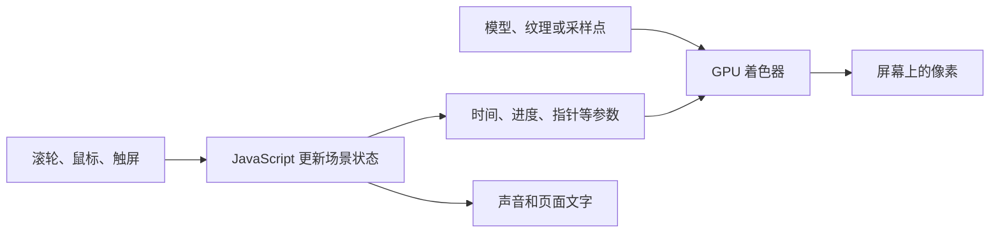

# 效果原理与实现拆解

本文对应本仓库当前快照。结论来自可读源码、随包的 Igloo 生产脚本，以及注明链接的原作者制作说明。解释性的公式会标明“示意”，不把它们当作原站完整算法。

## 1. 先分清三个项目

| 部分 | 入口 | 实际包含什么 | 适合做什么 |
| --- | --- | --- | --- |
| Igloo 本地复现 | `/` | 原站编译后的前端脚本、模型、纹理、声音，以及本地适配代码 | 观察冰屋、冰块、滚动转场、体积粒子；改已有内容 |
| FORMA 人物实验 | `/forma.html` | 可读的原生 JavaScript、Three.js、GLSL、HTML/CSS | 自己修改人物形态、粒子、布局和交互 |
| Hologram 学习快照 | `learning/hologram-particles/`，需独立启动 | 第三方 Next.js、React、Three.js WebGPU/TSL 源码 | 学习 GLB 采样、立体粒子、GPU 回弹 |

根工程的 `npm install` 不会安装第三个项目。Igloo 和 FORMA 都通过 WebGL 渲染，但两者没有共用人物生成或粒子物理系统。原站生产脚本内也自带了自己的 Three.js 代码，升级根目录 `three` 依赖主要影响 FORMA。

## 2. 页面不是视频：浏览器每一帧都在计算



JavaScript 管理“现在选谁、鼠标在哪、动画进行到哪里”；GPU 同时处理大量顶点和像素。Three.js 负责场景、摄像机、几何数据、材质和渲染器之间的组织。Vite 负责开发服务器与构建，本身不生成冰块或粒子效果。

着色器分两类：顶点着色器决定点或网格顶点的位置，片元着色器决定覆盖到的像素颜色和透明度。FORMA 用 [`ShaderMaterial`](https://threejs.org/docs/pages/ShaderMaterial.html) 提供自定义 GLSL；这与使用普通 CSS 动画移动几万个元素的工作方式不同。

## 3. Igloo：加载和场景组织

代码链路：

```text
index.html
  → src/igloo/main.js
  → GET /study/content.json
  → public/assets/index-2eb69c09.js
  → public/assets/App3D-f554a111.js
  → 几何、纹理、字体、音频及解码器
```

[`src/igloo/main.js`](../src/igloo/main.js) 先探测 WebGL 2，再读取内容 JSON，最后加载原站入口。原脚本经过 [`scripts/patch-igloo.mjs`](../scripts/patch-igloo.mjs) 的固定补丁，读取 `window.IGLOO_CONTENT` 并在初始化后暴露 `window.iglooStudy`。

内容通过 `Object.assign` **浅合并**到原配置：如果覆盖 `cubes` 或 `manifesto`，整个数组或对象会被替换。因此应编辑完整的 `content.json`，不能只留下一个嵌套字段就期望其余字段自动保留。

### 3.1 滚动为什么像连续镜头

生产脚本中能检索到 `scrollComposers`、`scroll.targetY1`、`scroll.targetY2`、`scroll.y`、`centerScroll`。滚轮输入先更新目标位置，再经过平滑处理；各个场景根据自己的区间计算进度，更新相机、物体和显示状态。

可以用下面的**示意公式**理解这种关系，具体场景会附加不同的缓动和时间段：

```js
progress = clamp((scroll - sectionStart) / sectionLength, 0, 1);
cameraPosition = interpolate(startPosition, endPosition, ease(progress));
```

这里的滚动主要是一个动画控制量，不只是把长页面往上移动。详情页还涉及路由、滚动锁定、相机动画和返回状态，所以“换一个项目”也不是简单切换 DOM 卡片。

### 3.2 冰霜、色散和画面切换

生产脚本中的合成材质包含 `tScene1`、`tScene2`、`uProgress`、`tFrost`，以及 `chromatic_aberration`。可以把它理解为先把场景画成纹理，再对这些纹理进行扭曲、遮罩和混合。

- **位移**：改变纹理采样坐标，画面就像被拉扯或错位。
- **冰霜遮罩**：用霜纹理控制局部覆盖、颗粒和过渡边界。
- **色散**：让不同颜色通道在略有差异的位置采样，产生边缘色彩分离。
- **镜头运动**：场景本身的相机变化与上述合成效果同时发生。

这些是生产脚本中可确认的结构；要重写时可以先做两场景混合，再逐步加位移和霜纹。只修改 `src/style.css` 不会改变 Igloo 的这个合成过程。

### 3.3 冰块为什么有厚度和折射

本地已有 `cube1.drc`、`cube2.drc`、`cube3.drc`，并配套 `cube*_normal.ktx2`、`cube*_roughness.ktx2`、环境纹理和内部物体。几何决定外轮廓，法线纹理改变表面光照方向，粗糙度控制反射或透射的模糊程度。

材质代码中能定位到 `getIBLVolumeRefraction2`、`uThickness`、`uAttenuationColor`、`uChromaticAberration`。这说明视觉不是“一个半透明立方体”：还有厚度、吸收、折射、多通道采样和表面扰动参与计算。它也不是浏览器在每帧重新生长整块冰晶。

原作者介绍，冰块模型来自模拟晶体生长的程序化建模流程，建模和纹理制作使用 Houdini、Blender；本包只带导出的结果，不含该建模工具或工程。[Abeto 制作说明](https://www.awwwards.com/igloo-inc-case-study.html)

### 3.4 末尾粒子如何形成实体轮廓

关键资源在 [`public/assets/images/volumes/`](../public/assets/images/volumes/)，配置项为 `links[].vdb`。生产着色器使用 `sampler3D tVolume`，并读取其中四个通道：

```glsl
vec4 volData = texture(tVolume, samplePos);
vec3 grad = normalize(volData.rgb * 2.0 - 1.0) * rotMatrix;
float dist = (volData.a * 2.0 - 1.0) * 2.0;
```

代码把 RGB 解码为方向，把 Alpha 解码为带符号的距离量。于是粒子可以查询“我所在的位置相对目标形体在哪里、该朝哪边移动”。它还从 `tTexture1` / `tTexture2` 读取上一轮的位置与速度，写出新的 `outPos` / `outVel`。

在该计算段中能直接看到以下步骤：

1. 根据粒子投影到屏幕上的位置，读取鼠标流体模拟的速度纹理 `tVel`。
2. 加入 `BitangentNoise4D` 形成旋涡般的运动。
3. 加入回到 `tOrig` 初始位置的趋势，以及由体积方向和距离符号控制的作用力。
4. 施加随帧率修正的摩擦，推进位置，并把粒子限制在指定范围内。
5. 用体积方向计算明暗，用平滑后的速度长度为发光提供数据。

这是一套保存状态的 GPU 模拟，不等同于单纯在两个点数组之间插值。流体部分还能检索到 `FLUID_ADVECTION`、`FLUID_VORTICITY` 和读写纹理的 `swap()`：速度场被持续传递和更新，因此鼠标划过有拖尾和涡流感。

把这些作用概括成**示意公式**是：

```text
新速度 = 旧速度 + 鼠标流场 + 噪声 + 回归力 + 体积约束力
新速度 = 新速度 × 阻尼
新位置 = 旧位置 + 新速度 × 时间步长
```

原作者说明其体积数据来自自定义 VDB 导出和压缩流程。这里配置名叫 `vdb`，实际加载的是兼容该着色器的 KTX2 体积纹理，不能直接替换成 `.vdb` 或 `.glb` 文件。[Abeto 制作说明](https://www.awwwards.com/igloo-inc-case-study.html)

### 3.5 文字为什么能闪烁、乱码和融入场景

Igloo 的许多界面元素也是 WebGL 几何。字体采用 JSON 字形数据与 MSDF 纹理图集：一个字形对应图集中的区域，着色器从距离信息恢复清晰边缘。

改变字形采样区域可显示另一字符，改变采样坐标或透明度可做错位、扫描和显隐。本地生产脚本中能定位到 `msdf()`、`signedDist`、`fwidth`。已有补丁给导数加非零下限，处理软件渲染时出现整块白色文字的问题。

**限制来自图集本身**：原图集中没有的汉字不会因为 JSON 换成中文就出现。要支持中文，需要重新生成图集与排版数据，或者另做 HTML 中文内容层。FORMA 的 HTML 文字没有这个特定限制。

## 4. FORMA：从几何到可以触碰的人物粒子

主要读 [`src/forms.js`](../src/forms.js)、[`src/scene.js`](../src/scene.js)、[`src/main.js`](../src/main.js)。

### 4.1 用简单几何拼出人物

`figureBuilder()` 提供五类工具：

| 函数 | 几何 | 用途 |
| --- | --- | --- |
| `ell()` | 缩放后的球体 | 头部、躯干、关节 |
| `box()` | 圆角盒子 | 背包、胸前设备、鞋 |
| `limb()` | 圆柱和端点球 | 上下臂、腿 |
| `ring()` | 圆环 | 领口、腕口、装饰 |
| `curve()` | 沿曲线生成的管道 | 软管、衣服线条、飘带 |

`explorer()`、`dancer()`、`runner()` 分别组合这些零件。修改肘部端点坐标，就能改变手臂方向；修改缩放可改变身体比例。这三个角色不是从人物照片或外部模型识别生成的。

### 4.2 把人物表面采样成点

`createForms(count)` 对每个零件计算三角形面积，然后按 `面积 × weight` 分配采样概率。选定零件后，由 [`MeshSurfaceSampler`](https://threejs.org/docs/pages/MeshSurfaceSampler.html) 在网格表面抽取位置与法线。

例如躯干面积远大于按钮，通常应分到更多粒子；对细管和装饰提高 `weight`，可以让细节不至于稀疏。每个人物最终都得到相同长度的两个数组：

```text
positions = [x0, y0, z0, x1, y1, z1, ...]
colors    = [r0, g0, b0, r1, g1, b1, ...]
```

颜色不仅来自 `silver`、`charcoal`、`orange`，还乘了法线与固定光照方向算出的明暗。因此人物有体积感，但这部分光照在采样阶段就写进了颜色，并非每帧重新进行完整的物理材质计算。

### 4.3 几万个粒子如何同时变形

`ParticleScene` 创建一份 `BufferGeometry`，把数据放进 GPU 顶点属性：

| 属性或参数 | 作用 |
| --- | --- |
| `position` | 出发点 |
| `aTarget` | 目标人物对应点 |
| `aColorFrom` / `aColorTo` | 起止颜色 |
| `aSeed` | 每颗粒子的差异 |
| `uMorph` | 全体共享的变形进度 |
| `uTime` / `uBurst` / `uPointer` | 时间、散开程度、指针位置 |

顶点着色器中的核心就是：

```glsl
float t = smoothstep(0.0, 1.0, uMorph);
vec3 p = mix(position, aTarget, t);
float wave = sin(t * 3.14159265);
p += swirl * wave * (0.5 + aSeed * 1.35) * uMotion;
```

`mix(A, B, t)` 等于 `(1-t)A + tB`；`wave` 在起止处为零，在中途最强，因此看起来是先散开、再收拢到下一人物，而不是所有点沿直线机械移动。

CPU 每帧主要更新少量 uniforms，GPU 为每颗粒子并行计算位置。切换角色的 `setForm()` 才会在 CPU 上更新起止属性数组。当前变形时长约为 1.65 秒，对应 `animate()` 的 `dt / 1.65`。

数组中第 i 个点对应另一个数组第 i 个点，**没有识别“手对应手、头对应头”**。随机对应适合烟雾式变形；想要部位连续，需要自己建立分组采样或点匹配。

### 4.4 鼠标排斥和长按散开

鼠标坐标先转到标准化设备坐标，再经相机反投影，与世界 `z=0` 平面求交，最后转换到人物组的局部坐标。顶点着色器计算点到指针的 XY 距离：

```glsl
float force = (1.0 - smoothstep(.0, .62, dist)) * .19 * uMotion;
p.xy += normalize(delta.xy + vec2(.0001)) * force;
```

`.62` 是影响范围，`.19` 是位移强度。长按或空格则提高 `uBurst`，沿向外方向加位移；松开后参数缓动回零。

**这里不是 Igloo 那套流体模拟，也没有逐粒子速度积分**。FORMA 每帧根据初始/目标位置和当前参数重新算偏移，所以回聚容易实现、代码也更短。指针计算针对当前全屏画布设计，嵌入局部容器时应减去容器的 `getBoundingClientRect().left/top`。

### 4.5 圆形粒子、亮边、地面和空间感

每颗粒子实际是 `THREE.Points` 的点精灵。片元着色器用 `gl_PointCoord` 求到中心的距离，丢弃圆外像素，并使边缘逐渐透明。

材质启用 `AdditiveBlending`，让重叠粒子的颜色相加；同时 `depthWrite: false`，避免透明点写入深度造成不自然遮挡。这个 FORMA 版本没有单独的 Bloom 后处理管线，不能把所有发亮都解释成 Bloom。

`addAtmosphere()` 另外添加 1,100 个背景尘埃点、一个着色器生成的地面光斑，以及圆环和刻度线。它们与相机透视、人物轻微摆动一起构成展厅空间感。

### 4.6 声音和操作手感

[`src/audio.js`](../src/audio.js) 用 Web Audio 振荡器生成环境和弦与切换提示音，不读取 Igloo 的 OGG 音频。用户点击 SOUND 后才初始化或恢复声音。

[`src/main.js`](../src/main.js) 中的交互阈值决定手感：滚轮累计到 65 后切换，锁定 1,200 毫秒以抑制连续触发；长按约 260 毫秒散开；触屏横滑超过 45 像素或竖滑超过 55 像素时切换。拖动旋转与长按通过位移阈值区分。

## 5. 性能：哪些成本能降低

FORMA 高精度绘制 48,000 个人物点，低精度绘制 18,000 个；低精度也限制像素比。`setDrawRange()` 只是减少绘制数量，当前仍会先生成三个完整的 48,000 点人物数组，所以 **LQ 主要减少渲染成本，不会同比降低初始化采样与内存成本**。

`requestAnimationFrame` 推进动画，时间步长上限为 0.05 秒；标签页隐藏时停止渲染。系统开启减少动态效果时，会关闭或减弱部分漂移、旋转和形变。移动端性能还受屏幕像素数、透明叠加和 GPU 能力影响。

优先优化顺序：降低像素比 → 减少可见粒子/透明叠加 → 减少初始化采样 → 再考虑 Worker、离线点云或 GPU 物理。增加粒子数量通常不能修复模型比例或镜头构图问题。

## 6. 如何自己从零实现相近效果

1. 建一个 Three.js 场景，只显示一个固定模型或一组静止点，确认摄像机和尺寸。
2. 实现模型表面采样，先让一个人物轮廓清楚可见。
3. 准备另一个同样数量的点数组，用 `mix()` 做 A → B。
4. 加平滑时间曲线，再加中途增强、两端归零的扰动。
5. 加鼠标局部偏移、长按散开和拖拽；先从 FORMA 的无速度方案入手。
6. 调整点大小、颜色、透明叠加，补背景尘埃、地面和文字。
7. 需要惯性与涡流时，再引入保存位置/速度的 GPU 计算；需要冰块时另建网格材质与场景转场流程。

更真实的人物可以通过 GLB 加载后采样。现成入口见 `learning/hologram-particles/`，它使用 WebGPU 存储缓冲与 `computeAsync(computePhysics)` 保存和更新偏移、速度；该独立项目本次只核对源码，没有验证运行。具体动手位置见 [修改指南](CUSTOMIZE.zh-CN.md)。
